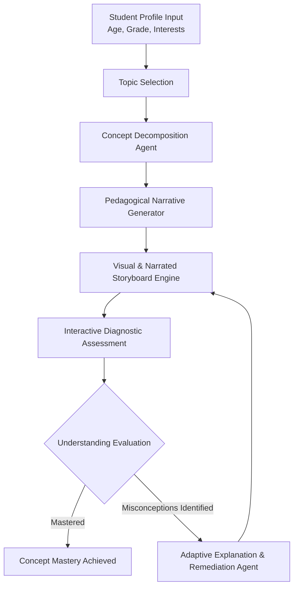
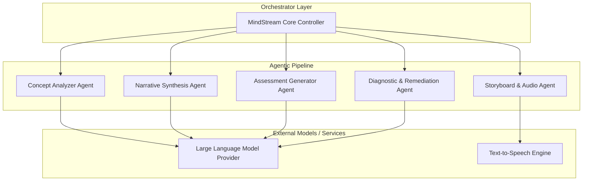

# MindStream

> **Transforming Academic Concepts into Personalized, Story-Driven Visual Journeys for K-12 Learners.**

---

## 1. Project Title & Tagline

**MindStream**  
*Adaptive, Story-Driven Visual Learning Engine for School Students.*

---

## 2. Problem Statement

Traditional K-12 education often relies on one-size-fits-all textbooks and rigid instructional videos. This creates several key learning barriers:

* **Lack of Context & Engagement:** Abstract concepts in STEM and humanities are disconnected from a student's personal interests (e.g., sports, gaming, space, or art), leading to disinterest and cognitive friction.
* **Rigid Grade-Level Explanations:** Explanations rarely adapt to cognitive maturity. A 3rd-grade student and a 9th-grade student are often forced into static content that is either too complex or overly simplified.
* **Passive Consumption:** Existing digital learning platforms serve static video content without actively evaluating where a student's conceptual misunderstanding lies.
* **Feedback Void:** When a student fails a quiz item, traditional tools simply present the correct answer key without diagnosing the root misconception or dynamically reformulating the narrative explanation.

---

## 3. Solution

**MindStream** bridges the gap between academic rigor and student engagement through AI-driven personalized and adaptive learning workflows. 

Rather than generating generic AI videos, MindStream dynamically synthesizes **personalized narrative lessons** tailored precisely to a student's age, grade level, and personal hobbies. 

```
               [ Student Profile & Hobbies ]
                            │
                            ▼
    ┌───────────────────────────────────────────────┐
    │          Concept Analysis Engine             │
    │  Maps Academic Topic to Target Pedagogical    │
    │                Objectives                     │
    └───────────────────────┬───────────────────────┘
                            │
                            ▼
    ┌───────────────────────────────────────────────┐
    │     Interest-Driven Story Synthesis           │
    │ Contextualizes Math/Science/History into      │
    │           Personalized Narratives             │
    └───────────────────────┬───────────────────────┘
                            │
                            ▼
    ┌───────────────────────────────────────────────┐
    │ Visual Lesson & Interactive Quiz Generator    │
    └───────────────────────┬───────────────────────┘
                            │
                            ▼
    ┌───────────────────────────────────────────────┐
    │         Misconception Analysis &              │
    │           Adaptive Remediation                │
    └───────────────────────────────────────────────┘
```

* **Personalized Contextualization:** Teaches gravity using basketball for a sports enthusiast, or using orbital mechanics for a space enthusiast.
* **Age-Appropriate Pedagogy:** Calibrates vocabulary, analogy depth, and cognitive load according to the student's grade level.
* **Interactive Diagnostic Loop:** Evaluates quiz responses to isolate specific conceptual gaps and crafts real-time targeted explanations.

---

## 4. How MindStream Works

MindStream operates through a closed-loop multi-agent workflow:



1. **Profile Calibration:** The system parses the student's age, grade/class, and core interests.
2. **Pedagogical Mapping:** Breaks down the target academic topic into key concepts appropriate for the learner's grade level.
3. **Narrative Engine:** Synthesizes an age-appropriate story where academic principles drive the plot forward.
4. **Visual & Auditory Lesson Delivery:** Converts the narrative into structured visual storyboards and narrated audio segments.
5. **Formative Assessment:** Presents interactive questions testing conceptual comprehension.
6. **Diagnostic Evaluation:** Analyzes answer patterns, pinpoints exact misunderstandings, and generates an adaptive re-explanation.

---

## 5. Key Features

* **Profile-Driven Personalization:** Tailors learning material dynamically based on age, grade level, and unique interests (e.g., gaming, cooking, fantasy, robotics).
* **Concept Decomposition Engine:** Automatically breaks complex topics into bite-sized learning objectives.
* **Contextual Storytelling:** Replaces abstract formulas with engaging narrative arcs tailored to the student.
* **Visual & Narrated Storyboarding:** Generates paired visual prompts and audio narration for multi-modal learning.
* **Diagnostic Assessment:** Goes beyond right/wrong scoring to analyze student reasoning and pinpoint specific misunderstandings.
* **Adaptive Remediation:** Automatically reformulates explanations using alternative analogies when misconceptions are detected.

---

## 6. Example User Journey

### Persona: Leo (Age 9, Grade 4)
* **Interests:** Superhero stories, Comic books
* **Selected Topic:** *Photosynthesis*

#### Step 1: Personalized Narrative Lesson
* **Concept:** Sunlight conversion to plant energy.
* **Personalized Story Arc:** *“Captain Chlorophyll and the Solar Shield”* — Leo reads a comic-style narrative where plant cells act as solar-powered headquarters converting light energy into secret fuel (*glucose*).

#### Step 2: Formative Assessment
* **Quiz Question:** *"What happens to Captain Chlorophyll when there is no sunlight?"*
* **Student Answer:** *"The plant breathes in soil instead to make energy."*

#### Step 3: Diagnostic Feedback & Adaptive Remediation
* **Misconception Identified:** The student confuses soil nutrients with light energy during energy synthesis.
* **Adaptive Re-Explanation:** *"Just like superhero suits can't charge without their solar power station, soil gives Captain Chlorophyll minerals (like vitamins), but cannot replace sunlight energy!"*

---

### Persona: Maya (Age 15, Grade 10)
* **Interests:** Astrophysics, Sci-Fi Worldbuilding
* **Selected Topic:** *Photosynthesis* (Same Academic Topic)

#### Step 1: Personalized Narrative Lesson
* **Concept:** Photophosphorylation & Calvin Cycle.
* **Personalized Story Arc:** *“Terraforming Exoplanet Kepler-186f”* — Maya explores bio-engineering alien flora to capture photons and fix carbon dioxide into organic matter under varying light wavelengths.

---

## 7. System / Agent Architecture

MindStream employs a modular agentic orchestration layout where dedicated components handle distinct phases of the learning lifecycle:



* **Concept Analyzer Agent:** Extracts pedagogical goals from academic syllabus guidelines.
* **Narrative Synthesis Agent:** Merges learning goals with interest hooks and age-appropriate vocabulary constraints.
* **Storyboard & Audio Engine:** Formats story scenes into visually structured slides and speech parameters.
* **Assessment & Diagnostic Agent:** Evaluates student inputs to categorize mastery vs. misunderstanding.

---

## 8. Technology Stack

> *Note: Below is the architecture layout designed for the MindStream platform implementation.*

| Domain | Technology / Tools |
| :--- | :--- |
| **Frontend Framework** | React.js / Next.js, Tailwind CSS |
| **Backend Service** | Python (FastAPI / LangChain) or Node.js (TypeScript) |
| **AI Orchestration** | LangChain / LlamaIndex / Direct Multi-Prompt Workflows |
| **LLM Engine** | OpenAI GPT-4o / Anthropic Claude / Google Gemini |
| **Text-to-Speech (TTS)** | ElevenLabs API / OpenAI Audio TTS |
| **Database & Persistence** | PostgreSQL / MongoDB (User profiles & learning sessions) |

---

## 9. Project Structure

```
EduTale/
├── src/                      # Source code (Planned / In Development)
│   ├── agents/               # AI Agents (Concept Analysis, Narrative, Diagnostic)
│   ├── components/           # UI Components (Storyboard Player, Quiz Modal)
│   ├── services/             # LLM & TTS Integration Services
│   └── utils/                # Helper utilities and prompt templates
├── public/                   # Static assets and media files
├── docs/                     # Documentation and architecture diagrams
├── .env.example              # Environment variables template
├── package.json              # Project dependencies & scripts
└── README.md                 # Project documentation
```

---

## 10. Installation and Setup

### Prerequisites

* Node.js (v18.x or higher) / Python 3.10+
* Git
* API keys for target LLM and TTS providers

### Steps

1. **Clone the Repository:**
   ```bash
   git clone https://github.com/pavanlanka18/EduTale.git
   cd EduTale
   ```

2. **Install Dependencies:**
   ```bash
   npm install
   # Or for Python backend services:
   # pip install -r requirements.txt
   ```

3. **Configure Environment Variables:**
   Copy `.env.example` to `.env` and fill in your API credentials (see Section 11).

---

## 11. Environment Variables

Create a `.env` file in the root directory with the following variables:

```env
# LLM Provider Configuration
OPENAI_API_KEY=your_openai_api_key_here
# ANTHROPIC_API_KEY=your_anthropic_api_key_here

# Audio / TTS Configuration
ELEVENLABS_API_KEY=your_elevenlabs_api_key_here

# App Configuration
PORT=3000
NODE_ENV=development
```

---

## 12. Running the Project

### Local Development Mode

To start the development server:

```bash
npm run dev
```

The application will be accessible at `http://localhost:3000`.

### Building for Production

```bash
npm run build
npm start
```

---

## 13. Example Usage

1. **Create Profile:** Enter learner profile (e.g., Name: *Leo*, Age: *9*, Grade: *4*, Hobbies: *Superheroes, Drawing*).
2. **Select Topic:** Pick a subject and concept (e.g., Science -> *Photosynthesis*).
3. **Interactive Lesson:** Step through the generated story scenes complete with visual descriptions and audio narration.
4. **Answer Quiz:** Complete the 3-question interactive diagnostic.
5. **View Adaptive Guidance:** Receive immediate feedback explaining any incorrect responses using personalized superhero analogies.

---

## 14. Hackathon Context

* **Event:** Hackathon Submission
* **Category:** Education / Generative AI / Agentic Workflows
* **Core Innovation:** Dynamic, interest-driven pedagogical adaptation that adjusts narrative metaphor depth, visual storytelling, and diagnostic re-explanations based on continuous feedback.

---

## 15. Future Scope

* [ ] **Multi-Modal Image Generation:** Direct integration with Flux/Midjourney APIs for custom image rendering per scene.
* [ ] **Gamified Mastery Trees:** Long-term skill maps tracking concepts mastered over time.
* [ ] **Voice-Interactive Q&A:** Speech-to-Text interface allowing younger children to answer quiz questions verbally.
* [ ] **Teacher & Parent Dashboards:** Analytics showcasing diagnostic insights on student misconceptions.
* [ ] **Offline Mode Support:** Lightweight local audio caching for low-bandwidth environments.

---

## 16. Team / Contributors

* **Pavan Lanka** - *Lead Developer & AI Orchestration*

---

## 17. License

Distributed under the [MIT License](LICENSE).
